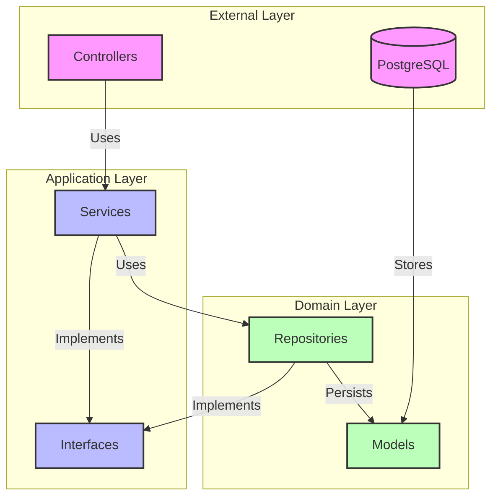
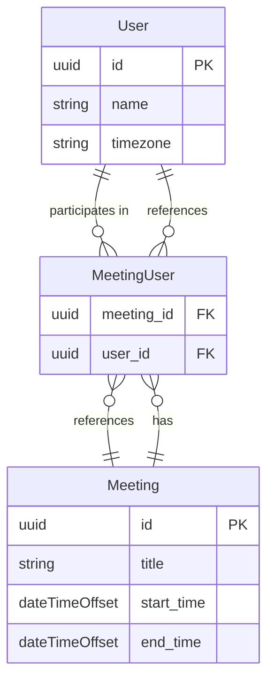

# Enterprise Scheduler

A .NET Web API project for enterprise-level scheduling and task management.

## ℹ️Description

This project provides a robust API for managing and scheduling meeting.

## 🛫Getting Started

### Prerequisites

- .NET 8.0 SDK
- Docker

### Running the Project

1. Clone the repository
```bash
git clone https://github.com/YOUR_USERNAME/REPO_NAME.git
```

2. Navigate to the project directory
```bash
cd EnterpriseScheduler
```

3. Start the PostgreSQL database using Docker Compose
```bash
docker compose up -d
```

This will start a PostgreSQL container with the following configuration:
- Port: 5432
- Database: scheduler_db
- Username: scheduler
- Password: scheduler123

### Database Migrations

If you're running the project for the first time, you'll need to apply the database migrations:

```bash
dotnet tool install --global dotnet-ef

cd src/EntrepriseScheduler
dotnet ef database update
```
### PostgreSQL console

To get inside PSQL:

```bash
docker exec -it scheduler-postgres psql -U scheduler -d scheduler_db
```

### Run the project
```bash
cd src/EntrepriseScheduler
dotnet run
```

The API will be available at `http://localhost:5086`

### Stopping the Database

When you're done, you can stop the PostgreSQL container:

```bash
docker compose down
```

## 📄API Documentation

The API documentation is available [here at `/swagger`](http://localhost:5086/swagger/index.html) when running the application.

## ⚠️Troubleshooting

### Common Issues

1. **Port 5432 is already in use**
   - Check if you have another PostgreSQL instance running
   - Stop the other instance or change the port in docker-compose.yml

2. **Docker Desktop not running**
   - Make sure Docker Desktop is running before executing docker compose commands
   - Start Docker Desktop from the Start menu

## 📌Architecture



## 🔗DB diagram


